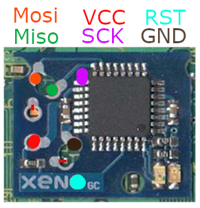

# xenogcfork by drcref

This is a fork of vingt-2's xenogcfork fork which is a fork of the original xenogcfork published by emukidid.

This firmware for your XenoGC modchip allows you to boot into a DOL file on an SD card (in either Memory Card slot, or SP2SD2) by holding down START on the controller when you power on your GameCube with ANY readable disc in the drive.

This is achieved by replacing the multi-game disc shell/loader originally present in Xeno GC with a new custom loader that supports SD cards, FAT32 and SP2SD2.

Your SD card must be FAT32 formatted with a single partition.

The loader attempts to mount an SD card in the SP2 port, Memory Card Slot B or Memory Card Slot A (in that order) then looks for a file named ``swiss.dol`` in the root directory.

# Installation  
There are two ways to install this onto your XenoGC: The simplest and basically free method is to use the XenoFlash software updater. Unfortunately, you still need to take your GameCube apart to get to the XenoGC modchip, and will need to solder its RST and GND pads to a switch, so the reset line of the ATmega8 can be activated on demand as required for flashing.

The second method is flashing the ATmega8 directly from your PC using a USB ISP programmer (a USBtinyISP or USBasp can be had for £5 on eBay) and AVRdude. You will need to solder wires to the programming pins of the ATmega8.

There's a non-zero chance a failed update via XenoFlash might brick your modchip. In that case you will need to use the second method to reprogram it.

# Flashing using the software flasher
This consists of using the XenoFlash.dol utility provided at the root of this repository. Note that this tool is a little finicky, however, I have been able to properly flash my chip with these exact steps about a dozen times without fail, so I'd say it's pretty safe (I repeatedly flashed the chip using my programmer, checked the version, then used these steps to flash it with the dol, and verified that it was indeed updated) so I'm confident this will work (on an actual XenoGC, that is, with an Atmega8 chip).
First, you will unfortunately still need to take your Gamecube apart, and to get to the optical drive. You will then need to solder a wire from the RST pad (any of the xeno letter !) and the ground pad to a Single Pole, Single Throw (aka... a switch) (see picture [1]). Once that's done..
  * Place the XenoFlash.dol on your sd card / memcard, and boot load it with the loader of your choice.
  * Wait til the dol has fully booted and is displaying instructions.
  * Turn the switch ON (that is to drive RST to GND), the LED should turn OFF. If it doesn't, verify your wires.
  * Press Y, this will attempt to erase the flash.
  * Turn the switch back OFF (that is normal operation), the LED should be lit up again (red)
  * Turn the switch back ON (that is to drive RST to GND), the LED should turn off again.
  * Press Y, this will actually properly erase the flash.
  * Turn the switch OFF (that is, normal operation), the LED should NOT light up at this point.
  * Turn the switch back ON (that, is to drive RST to GND), the led should still NOT light up, obviously
  * Press A, this will flash the firmware onto the chip. This is a longer operation, wait until it says it's done.
  * Turn the switch back OFF, (normal operation) and the LED should shine again (red, not orange on an original XenoGC). If it does you can turn off the gamecube. If it doesn't, turn the switch back on again (that, is to drive RST to GND) and retry to flash until it's successful (as in the led turns on).
 
At this point, turning on your GameCube with a readable disc in the drive, and holding START, should greet you with your ``swiss.dol`` loading (takes 15-30 seconds from power-on).

[Picture of the wiring](software_installer_switch.jpg)[1]

# Flashing using a USB programmer
You can also flash the chip directly using the ISP protocol to talk to the atmega8. The make file is configured to use a USBasp programmer, if you have a different programmer you must update the Makefile accordingly.

You will need to download [avrdude](https://www.nongnu.org/avrdude/) and place both files at the root of the repo.

Now is solder time, I like using DuPont head style cables so I can tightly connect each pin of the programmer. Once you have soldered all the wires to the pcb and connected each pin to the programmer (see [2] for solder points).

Just enter ``make flash`` in a command line in the repo, (you mind need to install make on windows). This will flash xenoAT.hex that is located in XenoAT/. You can now put the optical drive back on its socket and give it a spin.

[2]

# To compile this yourself
You will need to install both [devkitppc](https://devkitpro.org/wiki/Getting_Started) and their GameCube libraries (to compile XenoLauncher and XenoFlash) as well as the [AVR 8-bit Toolchain](https://www.microchip.com/en-us/tools-resources/develop/microchip-studio/gcc-compilers) (to compile the ATmega AVR binary).
